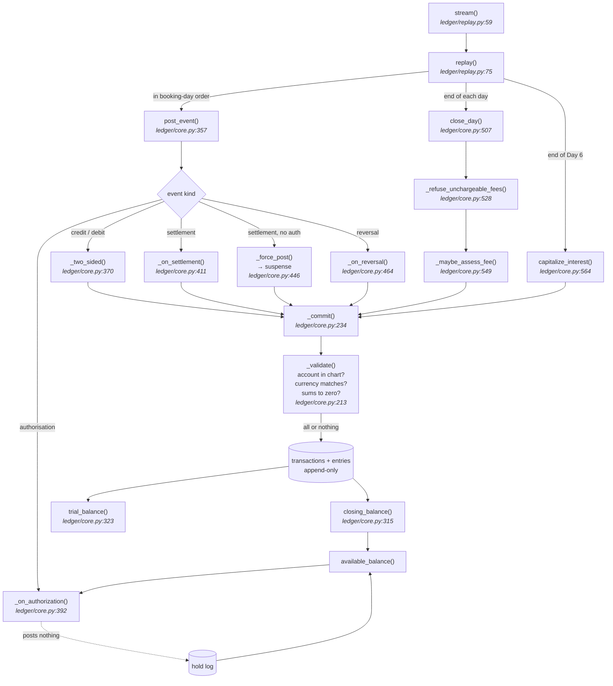
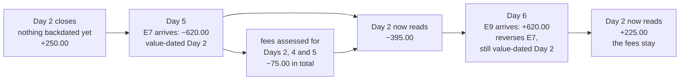

# In-memory account ledger core

An append-only, value-dated, double-entry ledger for two accounts over a
six-day window. No web layer, no persistence, no database, and no dependencies
beyond `pytest`.

## What's here

Read top to bottom for the argument; the sub-entries are the parts worth
jumping to.

- **[REJECTED.md](REJECTED.md)** — which acceptance criteria are wrong, and
  what was abandoned mid-build. *Start here.*
  - [The verdict](REJECTED.md#verdict) — five refused, one true but unreachable
  - [Criterion 2](REJECTED.md#c2) — three fees, not one, and false under
    *either* resolution of the backdating question
  - [Criterion 4](REJECTED.md#c4) — an unmatched settlement is a force post,
    not something a ledger can decline
  - [Criterion 8](REJECTED.md#c8) — the discarded remainder is real here: 0.69
    against a true 0.70
  - [Approaches abandoned mid-build](REJECTED.md#approaches-abandoned-mid-build)
    — single-entry postings, and appending legs one at a time
- **[AMBIGUITIES.md](AMBIGUITIES.md)** — 24 questions the brief left open,
  indexed, each with what it costs if resolved the other way
  - [A1](AMBIGUITIES.md#a1) — does a closed day reopen when a backdated entry
    lands? The fork that moves every figure; both answers are implemented
  - [A5](AMBIGUITIES.md#a5) and [A7](AMBIGUITIES.md#a7) — what "the capitalized
    total" is, and which day gets the spare fils
  - [A9](AMBIGUITIES.md#a9) — why the fee is refused rather than converted
  - [A20](AMBIGUITIES.md#a20) — which licence this runs under; two of the
    brief's own rules would not survive an Islamic one
  - [A22](AMBIGUITIES.md#a22) — where the other side of each posting goes
- **[NUMBERS.md](NUMBERS.md)** — every constant, with its sensitivity measured
  rather than asserted
  - [The overdraft fee](NUMBERS.md#fee)
    is a threshold, not a slope: at 30.01 a fourth fee appears, and halving it
    changes nothing
  - [Rounding](NUMBERS.md#rounding)
    happens once, at one call site
  - [Constants deliberately absent](NUMBERS.md#absent)
- **[SOURCES.md](SOURCES.md)** — what the jurisdiction-specific claims rest on
  - [Consulted](SOURCES.md#consulted) versus
    [asserted from prior knowledge](SOURCES.md#asserted)
- **[WORKLOG.md](WORKLOG.md)** — what happened, in order, including the parts
  that went wrong
- **`doc/architecture.pdf`** — Part 2. Scale, the regulatory surface of value
  dating, the authorisation lifecycle, and what was cut.
  `doc/architecture.tex` is the source.

## Results

**Five of the eight acceptance criteria are wrong** — 2, 4, 6, 7 and 8.
Criterion 5 is true but describes a branch this stream never reaches, because
Auth-B is declined. The reasoning is in REJECTED.md; each refusal has a test
that asserts the criterion false rather than encoding it.

The figures the replay produces:

| | |
|---|---|
| overdraft fees | **three**, value-dated Days 2, 4 and 5, all assessed on Day 5 |
| ACC-001 at Day 6 | **210.70 AED** — it closed Day 5 at −410.00 |
| capitalised interest | **0.70 AED**, apportioned `0.10 0.09 0.25 0.10 0.08 0.08` |
| ACC-002 instalments | **3.334 / 3.333 / 3.333 BHD**, summing to exactly 10.000 |
| ACC-002 interest | **0.008 BHD**, exact, no apportionment needed |
| unreconciled | **180.00 AED** in suspense — the settlement that matched no authorisation |
| trial balance | zero in both currencies, on every day |

One test fails on purpose. It shows that overdraft assessment in this design
depends on the *arrival order* of events rather than on the log: the same
entries produce three fees or none depending on whether a correction is booked
before or after midnight. See [the failing test](#the-failing-test).

## How an event becomes a balance



Every `file:line` above is checked by `tests/test_documentation.py`, which
opens the line and confirms the symbol is on it — a stale citation is worse
than none, because it sends a reader somewhere wrong while looking
authoritative.

Everything that changes the log goes through one function. An authorisation is
the only event that posts nothing — it writes to the hold log, which is why it
is also the only one that cannot unbalance the book.

## Running it

Python 3.12 or newer.

```sh
python3 -m venv .venv && . .venv/bin/activate
pip install -e '.[test]'

make test      # full suite: 129 pass, 1 xfail (the deliberate one)
make run       # replay the six days and print the report
make run-pit   # the same replay under the alternative fee policy
make gap       # run the failing test unmasked, so it shows red
make complexity  # cognitive complexity gate (complexipy) + McCabe report (radon)
make check       # both
```

`make complexity` needs the dev extra: `pip install -e '.[dev]'`. It gates
cognitive complexity at 15 per function and reports cyclomatic complexity
alongside, because the two metrics disagree in useful ways -- a flat function
with many branches scores badly on McCabe and fine on cognitive, and deep
nesting does the reverse.

Without a virtualenv, `PYTHONPATH=. python3 -m pytest` works too — the package
has no runtime dependencies.

## Reading the report

```
Restated at end of Day 6 (all entries, by value date)
  day           ACC-001           ACC-002
    2        225.00 AED         0.000 BHD
```

The table at the top is the ledger **as it reads now**: for each day, the sum
of every entry with `value_date <= day`, with all six days of knowledge in
hand. This is the balance the fee rule is defined against.

```
Day 2
  closed at         ACC-001  250.00 AED
  restated          ACC-001  225.00 AED  (backdated entries arrived after this close)
  fee               ACC-001  -25.00 AED  (assessed on Day 5, value-dated Day 2)
  authorisation     Auth-A  ACTIVE  (200.00 AED)
  error             none
```

Then one block per day:

- **closed at** — the balance as it stood when that day actually closed. Day 2
  closed at +250.00; nothing then known made it negative.
- **restated** — printed only when the two differ. E7 arrived on Day 5
  value-dated Day 2 and rewrote history. Both numbers are needed to explain a
  fee to anyone: the first is what the customer's statement said, the second is
  why they were charged.
- **fee** — value-dated into the day it is shown under, with the day it was
  actually assessed on in brackets. Under the default policy all three fees are
  assessed on Day 5, dated into Days 2, 4 and 5.
- **authorisation** — the state of every authorisation known as of that day:
  `ACTIVE`, `SETTLED`, `RELEASED` or `DECLINED`.
- **error** — declines, force posts and rejected instructions. E6 settles an
  authorisation that never existed and is force-posted; E8 is declined.

```
Interest
  ACC-001  daily: 0.10  0.09  0.25  0.10  0.08  0.08
  ACC-001  capitalised on Day 6: 0.70 AED
```

The daily figures are a decomposition of the single capitalised credit, not six
independent roundings — they sum to it exactly, by construction. Day 4's exact
accrual is 0.0940 and appears as 0.10 because that is where the remainder was
placed. See AMBIGUITIES A5.

```
Trial balance at end of Day 6
  AED
    ACC-001                210.70
    CLEARING-AED          -465.00
    SUSPENSE-AED           180.00
    INCOME-FEES-AED         75.00
    EXPENSE-INTEREST-AED    -0.70
                          -------
    sum                      0.00
```

Finally the whole book. Postings are double-entry, so every currency must
cancel to zero; if a `sum` line here is non-zero the ledger is broken, and the
tests say so before the report does.

It is grouped by currency rather than listed flat, because a column mixing AED
and BHD could not be added up — and because within one currency every figure
carries the same scale, so the decimal points align without any special
handling. There is deliberately no grand total across currencies.

`SUSPENSE-AED` holds the force-posted settlement that matched no
authorisation: an unreconciled position, parked somewhere an operator can see
and age it.

### Why a day has two balances

The same question — *what is ACC-001's closing balance for Day 2?* — has three
different correct answers, depending on when it is asked. Nothing about Day 2
changed; what changed is what the ledger had been told.



This is the whole exercise in one picture. A statement posted after Day 2
closed said +250.00 and was correct. The customer was later charged for being
overdrawn on that day, and the charge was also correct. The reversal on Day 6
returns the money but **not** the fees, which is why criterion 6 is refused:
an append-only ledger does not return to an earlier state, it only arrives at
a balance that may again resemble one.

## The failing test

`tests/test_known_gap.py` fails on purpose and carries its explanation inline.
It shows that overdraft assessment in this design depends on the *arrival
order* of events rather than on the log itself: the same entries produce three
fees or none depending on whether a correction is booked before or after
midnight. It is marked `xfail(strict=True)` so the suite stays green while the
failure stays visible — `make gap` runs it unmasked.

## Part 2 — architecture document

`doc/architecture.tex` is the source; `doc/architecture.pdf` is the built
three-page document that is submitted. Rebuild with `make doc` (needs a LaTeX
toolchain).

## Layout

```
ledger/money.py    Money as integer minor units; exact allocation and apportionment
ledger/events.py   The input stream: booking day and value date, kept separate
ledger/core.py     Transactions, postings, the chart, and the views over them
ledger/replay.py   The six-day replay and the report
tests/             Primitives, the replay, one test per criterion, and the gap
doc/               Architecture & trade-offs document (LaTeX source and PDF)
```

## Design in one paragraph

The ledger is layered: an entry is an account and a signed amount, a
transaction carries what is true of all its legs, and handlers turn business
events into balanced postings. A new product should be a new chart entry and a
new posting rule, not a new type in the core.

Money is an `int` in a currency's own minor units, inseparable from its
currency; the scale lives in one registry rather than on each entry, and no
`float` appears anywhere. The log is append-only — balances, hold states and
authorisation outcomes are all derived by scanning it, never stored in a field
that could drift. Corrections are new entries: E9 posts a contra credit, it
does not remove E7. Because a value-dated entry can change a day that has
already closed, the ledger keeps two views of every day and reports both.
